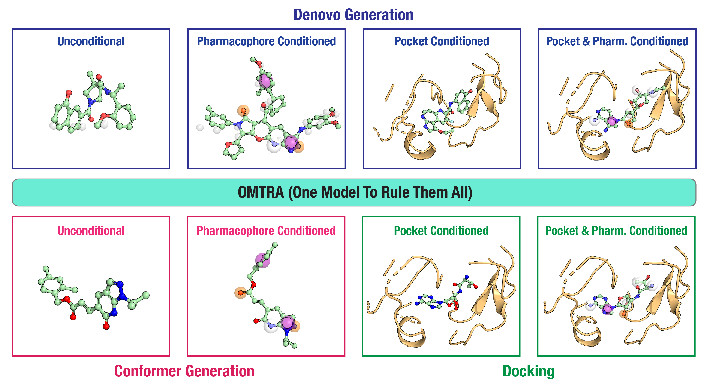

# OMTRA
A Multi-Task Generative model for Structure-Based Drug Design



-----------------------------------------------------------------------------------------------------

there are generally two ways to use omtra.
1. build the environment manually inside a conda/mamba env that you create. 
2. build a docker container from a docker file or pull our pre-built docker image.


# Installation

There are two options:
1. Build the OMTRA environment manually (via pip)
2. Use the provided Docker image. This is also the recommended option if you want use the web application interface.

We assume you are going to run OMTRA in an environment meeting the following criteria: 

- Linux System
- NVIDIA GPU with CUDA support

## Building the Docker Environment

## Docker Image

We assume the following about your system:
- Docker and Docker Compose installed
- NVIDIA Container Toolkit installed
- Model weights downloaded to `OMTRA/checkpoints/` directory

## Start CLI with pre-built image

#TODO: i think the docker-cli-setup.sh only pulls the images from a registry? if so,
 we need to make it possible for somebody to like, also define the CLI/docker override situation but
 if they build their own image locally for the docker file. so the instructions need to make this option clear.

1. **Setup:**
   ```bash
   source docker-cli-setup.sh
   ```

   To make this permanent, add to your `~/.bashrc` or `~/.zshrc`:
   ```bash
   source /path/to/OMTRA/docker-cli-setup.sh
   ```

2. **Use the CLI:**
   ```bash
   omtra --task <task> [options]
   ```
   The docker image will be automatically pulled from registry on first use.

### Additional System Requirements for using Docker

- Docker and Docker Compose installed
- NVIDIA GPU with CUDA support
- NVIDIA Container Toolkit installed
- Model weights downloaded to `OMTRA/checkpoints/` directory

## Manual Installation

```bash
# Create conda/mamba environment
mamba create -n omtra python=3.11
mamba activate omtra

# Clone, run build script
git clone https://github.com/gnina/OMTRA.git
cd OMTRA
chmod +x build_env.sh
./build_env.sh
```

The build script installs the CUDA-enabled versions of PyTorch, DGL, and PyG, and then installs the OMTRA package and its dependencies.

-----------------------------------------------------------------------------------------------------
# Sampling 

There are two ways to sample a trained OMTRA model. You can use the OMTRA web application or the command-line interface.


## OMTRA CLI

#TODO: full descripton of CLI interface. Can be inferred from cli.py

```bash
omtra --task denovo_ligand_condensed \
  --n_samples 100 \
  --output_dir outputs/samples \
  --metrics

omtra --task fixed_protein_ligand_denovo_condensed \
  --protein_file protein.pdb \
  --ligand_file ref_ligand.sdf \
  --n_samples 50

```

## OMTRA web application

Assuming you built the docker image? or already pulled the image? i think?

```bash
cd omtra_webapp
docker-compose up -d
```

The webapp will be available at http://localhost:5900 (or the port specified in your `.env` file).

See [`omtra_webapp/START.md`](omtra_webapp/START.md) for more details

-----------------------------------------------------------------------------------------------------
# Training
Refer to [docs/training.md](docs/training.md) for details on training OMTRA models.

-----------------------------------------------------------------------------------------------------
# Pharmit Dataset
Refer to [docs/pharmit_dataset.md](docs/pharmit_dataset.md) for details on the Pharmit dataset and how to use it.

# Evals and Reproducing Paper Results
Refer to [docs/reproducing_results.md](docs/reproducing_results.md) for instructions on reproducing the published results.