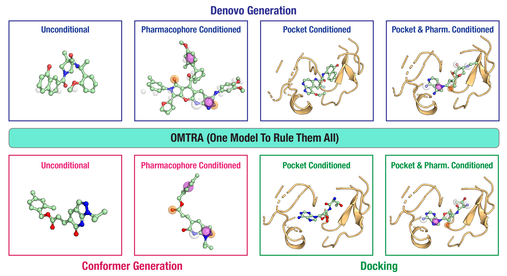

# OMTRA: A Multi-Task Generative model for Structure-Based Drug Design

<p align="center">
  
</p>

OMTRA is a flow-matching based generative model for small-molecule + protein systems. It supports a variety of tasks relevant to structure-based drug design, including:
- Unconditional 3D de novo molecule generation
- Unconditional ligand conformer generation
- Protein Pocket-conditioned de novo molecule design
- Protein-ligand docking (rigid and, flexible coming soon)
- Pharmacophore-conditioned molecule generation
- Pharmacophore-conditioned conformer generation
- Protein AND pharmacophore-conditioned molecule design
- Protein AND pharmacophore-conditioned docking

OMTRA is described in our preprint: [https://arxiv.org/abs/2512.05080](https://arxiv.org/abs/2512.05080) and will be presented at MLSB 2025.

<p align="center">
  
</p>

-----------------------------------------------------------------------------------------------------

## Table of Contents
- [Installation](#installation)
  - [Manual Installation (Recommended)](#manual-installation-recommended)
  - [Docker Installation](#docker-installation)
- [Model Weights](#model-weights)
- [Sampling](#sampling)
  - [CLI Reference](#cli-reference)
  - [Available Tasks](#available-tasks)
  - [CLI Examples](#cli-examples)
  - [Pharmacophore File Formats](#pharmacophore-file-formats)
  - [Web Application](#omtra-web-application)
- [Training](#training)
- [Additional Documentation](#additional-documentation)

-----------------------------------------------------------------------------------------------------

# Installation

There are two ways to set up OMTRA:
1. **Manual Installation** — Build the environment manually in a conda/mamba environment (recommended for most users)
2. **Docker Installation** — Use a Docker container for isolated, reproducible environments

### System Requirements

- Linux System
- NVIDIA GPU with CUDA support (CUDA 12.1 recommended)
- Python 3.11

## Manual Installation (Recommended)

This approach gives you direct control over the environment and is recommended for development and most use cases.

```bash
# Create and activate conda/mamba environment
mamba create -n omtra python=3.11
mamba activate omtra

# Clone the repository
git clone https://github.com/gnina/OMTRA.git
cd OMTRA

# Run the build script
chmod +x build_env.sh
./build_env.sh
```

The build script installs:
- CUDA-enabled versions of PyTorch, DGL, and PyG
- OMTRA package and all dependencies

After installation, the `omtra` command will be available:
```bash
omtra --task <task> [options]
```

## Docker Installation

Docker provides an isolated environment and is particularly useful for deployment or if you want to use the web application interface.

### Prerequisites

- Docker and Docker Compose installed
- NVIDIA Container Toolkit installed ([installation guide](https://docs.nvidia.com/datacenter/cloud-native/container-toolkit/install-guide.html))
- Model weights downloaded to `omtra/trained_models/` directory (see [Model Weights](#model-weights))

### Using the Pre-built Image

The CLI image is available on Docker Hub and will be automatically pulled when you first use it:

```bash
cd OMTRA
source docker-cli-setup.sh
omtra --task <task> [options]
```

The setup script will automatically pull `gnina/omtra:latest` from Docker Hub if it's not already available locally.

### Building the Docker Image Locally (Optional)

If you prefer to build the image yourself:

```bash
cd OMTRA
docker build -t gnina/omtra:latest .
```

Then set up the CLI wrapper:

```bash
source docker-cli-setup.sh
```

### Making the CLI Available Permanently

Add the following to your shell configuration (`~/.bashrc` or `~/.zshrc`):

```bash
source /path/to/OMTRA/docker-cli-setup.sh
```

### Customizing the Docker Image

You can specify a custom image name or version by setting the `OMTRA_CLI_IMAGE` environment variable before sourcing the setup script:

```bash
export OMTRA_CLI_IMAGE="gnina/omtra:v1.0.0"
source docker-cli-setup.sh
```

To disable GPU support (for testing on CPU-only machines):
```bash
export OMTRA_NO_GPU=1
```

-----------------------------------------------------------------------------------------------------

# Model Weights

Download the pre-trained model weights using `wget`:

```bash
wget -r -np -nH --cut-dirs=3 -R "index.html*" -P omtra/trained_models https://bits.csb.pitt.edu/files/OMTRA/omtra_v0_weights/
```

This will create the `omtra/trained_models/` directory with the checkpoint files. The CLI automatically selects the appropriate checkpoint based on the task. You can also specify a checkpoint explicitly with the `--checkpoint` flag.

-----------------------------------------------------------------------------------------------------

# Sampling

There are two ways to sample from a trained OMTRA model:
1. **Command-Line Interface (CLI)** — For scripting and batch processing
2. **Web Application** — For interactive exploration

## CLI Reference

### Basic Usage

```bash
omtra --task <task> [options]
```

The `omtra` command is available after either installation method. With manual installation, it's installed via `pip install -e .`. With Docker, the `docker-cli-setup.sh` script creates a shell function that wraps the Docker container.

### Core Arguments

| Argument | Type | Default | Description |
|----------|------|---------|-------------|
| `--task` | string | *required* | The sampling task to perform (see [Available Tasks](#available-tasks)) |
| `--checkpoint` | path | auto | Path to model checkpoint (auto-detected from task if not provided) |
| `--n_samples` | int | 100 | Number of samples to generate |
| `--n_timesteps` | int | 250 | Number of integration steps during sampling |
| `--output_dir` | path | None | Directory to save output files |
| `--metrics` | flag | False | Compute evaluation metrics on generated samples |

### Input File Arguments

For conditional generation tasks, you can provide input structures directly:

| Argument | Type | Description |
|----------|------|-------------|
| `--protein_file` | path | Protein structure file (PDB or CIF format) |
| `--ligand_file` | path | Ligand structure file (SDF format) |
| `--pharmacophore_file` | path | Pharmacophore file (JSON from Pharmit, XYZ, or SDF format) |
| | | **Pocket definition (choose one):** |
| `--pocket_ligand` | path | Path to reference ligand file (SDF) to define pocket around ligand atoms |
| `--pocket_center` | string | Pocket center coordinates as 'x,y,z' |
| `--pocket_residues` | string | Pocket residues as 'CHAIN:RESID,CHAIN:START-END' (e.g., 'A:123-125,B:200') |
| `--bbox_length` | float | Bounding box length (Angstroms) when using `--pocket_center` (default: 23.0) |

When input files are provided, `--n_samples` specifies how many samples to generate for that single input system.

### Advanced Sampling Options

| Argument | Type | Default | Description |
|----------|------|---------|-------------|
| `--stochastic_sampling` | flag | False | Enable stochastic (vs deterministic) sampling |
| `--noise_scaler` | float | 1.0 | Scaling factor for noise in stochastic sampling |
| `--eps` | float | 0.01 | Small epsilon value for numerical stability |
| `--visualize` | flag | False | Generate visualization of sampling trajectory |

### Ligand Size Control

| Argument | Type | Default | Description |
|----------|------|---------|-------------|
| `--use_gt_n_lig_atoms` | flag | False | Match ground truth ligand atom count |
| `--n_lig_atom_margin` | float | 0.15 | Margin (±%) around ground truth atom count |
| `--n_lig_atoms_mean` | float | None | Mean for normal distribution of atom counts |
| `--n_lig_atoms_std` | float | None | Std dev for normal distribution of atom counts |

## Available Tasks

OMTRA supports multiple drug design tasks. Use the `--task` argument to select one:

**Note:** Tasks marked with ⚠️ do not have pre-trained checkpoints available yet.

### Unconditional Generation
| Task | Description |
|------|-------------|
| `denovo_ligand_condensed` | Generate novel drug-like molecules from scratch |

### Protein-Conditioned Generation
| Task | Description |
|------|-------------|
| `fixed_protein_ligand_denovo_condensed` | Design ligands for a fixed protein binding site |
| `protein_ligand_denovo_condensed` ⚠️ | Joint generation of ligand with flexible protein |
| `exp_apo_conditioned_denovo_ligand_condensed` ⚠️ | De novo ligand generation starting from experimental apo structure |
| `pred_apo_conditioned_denovo_ligand_condensed` ⚠️ | De novo ligand generation starting from predicted apo structure |

### Docking Tasks
| Task | Description |
|------|-------------|
| `rigid_docking_condensed` | Dock a known ligand into a fixed protein structure |
| `flexible_docking_condensed` ⚠️ | Dock with protein flexibility |
| `expapo_conditioned_ligand_docking_condensed` ⚠️ | Docking starting from experimental apo structure |
| `predapo_conditioned_ligand_docking_condensed` ⚠️ | Docking starting from predicted apo structure |

### Conformer Generation
| Task | Description |
|------|-------------|
| `ligand_conformer_condensed` | Generate 3D conformations for a given ligand |

### Pharmacophore-Conditioned Tasks
| Task | Description |
|------|-------------|
| `denovo_ligand_pharmacophore_condensed` ⚠️ | Generate ligand and pharmacophore jointly |
| `denovo_ligand_from_pharmacophore_condensed` | Design ligand matching a given pharmacophore |
| `ligand_conformer_from_pharmacophore_condensed` | Generate conformer satisfying pharmacophore |
| `fixed_protein_pharmacophore_ligand_denovo_condensed` | Design ligand for protein with pharmacophore constraints |
| `rigid_docking_pharmacophore_condensed` | Dock ligand with pharmacophore constraints |
| `protein_ligand_pharmacophore_denovo_condensed` ⚠️ | Joint generation of ligand, protein, and pharmacophore |

## CLI Examples

### Generate Novel Molecules (Unconditional)
```bash
omtra --task denovo_ligand_condensed \
  --n_samples 100 \
  --output_dir outputs/denovo_samples \
  --metrics
```

### Structure-Based Drug Design (Protein-Conditioned)

Using a reference ligand to define the pocket:
```bash
omtra --task fixed_protein_ligand_denovo_condensed \
  --protein_file my_protein.pdb \
  --pocket_ligand reference_ligand.sdf \
  --n_samples 50 \
  --output_dir outputs/sbdd_samples
```

Using coordinates to define the pocket center:
```bash
omtra --task fixed_protein_ligand_denovo_condensed \
  --protein_file my_protein.pdb \
  --pocket_center 10.5,20.3,15.2 \
  --bbox_length 25.0 \
  --n_samples 50 \
  --output_dir outputs/sbdd_samples
```

Using specific residues to define the pocket:
```bash
omtra --task fixed_protein_ligand_denovo_condensed \
  --protein_file my_protein.pdb \
  --pocket_residues A:123-130,A:200,B:50-55 \
  --n_samples 50 \
  --output_dir outputs/sbdd_samples
```

### Molecular Docking
```bash
omtra --task rigid_docking_condensed \
  --protein_file protein.pdb \
  --ligand_file ligand.sdf \
  --n_samples 10 \
  --output_dir outputs/docking
```

### Conformer Generation
```bash
omtra --task ligand_conformer_condensed \
  --ligand_file molecule.sdf \
  --n_samples 20 \
  --output_dir outputs/conformers
```

### Pharmacophore-Guided Design

Using a pharmacophore file directly (JSON from Pharmit or XYZ):
```bash
omtra --task denovo_ligand_from_pharmacophore_condensed \
  --pharmacophore_file constraints.json \
  --n_samples 100 \
  --output_dir outputs/pharm_guided
```

Alternatively, extract pharmacophores from a ligand SDF file:
```bash
omtra --task denovo_ligand_from_pharmacophore_condensed \
  --pharmacophore_file reference_ligand.sdf \
  --n_samples 100 \
  --output_dir outputs/pharm_guided
```

-----------------------------------------------------------------------------------------------------

## Pharmacophore File Formats

OMTRA accepts pharmacophore constraints in three formats: **JSON** (from Pharmit), **XYZ**, or **SDF** (ligand file for automatic extraction). This section documents the JSON format, which provides the most control and is compatible with the [Pharmit](http://pharmit.csb.pitt.edu/) tool.

### Quick Start: Converting SDF to Pharmacophore JSON

The easiest way to create a pharmacophore JSON file is using the built-in converter:

```bash
# Basic usage
omtra mol2pharm ligand.sdf -o pharmacophore.json --pretty

# With verbose output to see extracted features
omtra mol2pharm ligand.sdf -o pharmacophore.json --pretty --verbose
```

This will extract pharmacophore features from your ligand and save them in the JSON format ready for use with OMTRA.

### JSON Format Specification

The pharmacophore JSON format follows the structure generated by Pharmit's command-line tool and web interface. While not a widely standardized format, it is the de facto format used by the Pharmit pharmacophore search engine.

#### Structure

```json
{
  "points": [
    {
      "name": "Aromatic",
      "x": 10.5,
      "y": 20.3,
      "z": 15.2,
      "enabled": true
    },
    {
      "name": "HydrogenAcceptor",
      "x": 8.2,
      "y": 18.7,
      "z": 14.1,
      "enabled": true
    }
  ]
}
```

#### Field Descriptions

- **`points`** (array, required): List of pharmacophore feature definitions
  - **`name`** (string, required): Pharmacophore feature type (see [Supported Feature Types](#supported-pharmacophore-feature-types))
  - **`x`**, **`y`**, **`z`** (float, required): 3D coordinates in Angstroms
  - **`enabled`** (boolean, optional): Whether this feature should be used (default: `true`)

#### Supported Pharmacophore Feature Types

OMTRA recognizes the following pharmacophore feature types:

| Feature Type | Description |
|--------------|-------------|
| `Aromatic` | Aromatic ring center (6-membered or 5-membered rings) |
| `HydrogenDonor` | Hydrogen bond donor (e.g., NH, OH groups) |
| `HydrogenAcceptor` | Hydrogen bond acceptor (e.g., C=O, N, O atoms) |
| `PositiveIon` | Positively charged or ionizable group |
| `NegativeIon` | Negatively charged or ionizable group (e.g., carboxylate) |
| `Hydrophobic` | Hydrophobic/lipophilic region |
| `Halogen` | Halogen bond donor (F, Cl, Br, I) |

**Note:** Features with unrecognized `name` values will be treated as `UNK` (unknown) type.

### Complete Example

Here's a complete pharmacophore JSON file defining a binding hypothesis with multiple features:

```json
{
  "points": [
    {
      "name": "Aromatic",
      "x": 12.456,
      "y": 8.234,
      "z": 15.789,
      "enabled": true
    },
    {
      "name": "HydrogenDonor",
      "x": 10.123,
      "y": 11.456,
      "z": 14.234,
      "enabled": true
    },
    {
      "name": "HydrogenAcceptor",
      "x": 14.567,
      "y": 9.890,
      "z": 13.456,
      "enabled": true
    },
    {
      "name": "Hydrophobic",
      "x": 11.234,
      "y": 7.890,
      "z": 17.123,
      "enabled": true
    },
    {
      "name": "PositiveIon",
      "x": 13.890,
      "y": 12.345,
      "z": 16.789,
      "enabled": false
    }
  ]
}
```

In this example, the `PositiveIon` feature is disabled (`"enabled": false`) and will be ignored during generation.

### Generating Pharmacophore JSON Files

You can create pharmacophore JSON files in several ways:

1. **OMTRA CLI Tool** (Recommended): Extract pharmacophores from ligand SDF files directly:
   ```bash
   omtra mol2pharm ligand.sdf -o pharmacophore.json --pretty
   ```
   
   Additional options:
   ```bash
   # Get verbose output with feature breakdown
   omtra mol2pharm ligand.sdf -o pharm.json --verbose
   
   # Create with all features disabled by default
   omtra mol2pharm ligand.sdf -o pharm.json --all-disabled
   
   # Process only first molecule in multi-molecule SDF
   omtra mol2pharm multi.sdf -o pharm.json --first-only
   ```

2. **Pharmit Web Interface**: Visit [http://pharmit.csb.pitt.edu/](http://pharmit.csb.pitt.edu/), upload a ligand, and export the pharmacophore features as JSON

3. **Pharmit Command-Line Tool**: Extract pharmacophores from a ligand SDF file:
   ```bash
   pharmit pharma -in ligand.sdf -out pharmacophore.json
   ```

4. **OMTRA Web Application**: Upload an SDF file to the web interface, which will automatically extract and visualize pharmacophore features for interactive selection

5. **Manual Creation**: Write JSON files directly using the format above, defining features at specific 3D coordinates based on your design hypothesis

### Alternative Format: XYZ

OMTRA also accepts a simpler XYZ format for pharmacophores:

```
7
Pharmacophore features
P 12.456 8.234 15.789
S 10.123 11.456 14.234
F 14.567 9.890 13.456
C 11.234 7.890 17.123
N 13.890 12.345 16.789
O 9.123 10.456 12.890
Cl 15.678 13.234 18.456
```

**Format specification:**
- Line 1: Number of pharmacophore points
- Line 2: Comment line (ignored)
- Lines 3+: `ELEMENT X Y Z` where `ELEMENT` is mapped to feature type:
  - `P` = Aromatic
  - `S` = HydrogenDonor
  - `F` = HydrogenAcceptor
  - `N` = PositiveIon
  - `O` = NegativeIon
  - `C` = Hydrophobic
  - `Cl` = Halogen

-----------------------------------------------------------------------------------------------------

### Debug Mode
Set the `OMTRA_DEBUG` environment variable for full stack traces:
```bash
OMTRA_DEBUG=1 omtra --task denovo_ligand_condensed --n_samples 10
```

-----------------------------------------------------------------------------------------------------

## OMTRA Web Application

The web application provides an interactive interface for exploring OMTRA's capabilities.

### Prerequisites
- Docker, Docker Compose, NVIDIA Container Toolkit installed
- Model weights downloaded to `omtra/trained_models/` directory (see [Model Weights](#model-weights))

### Starting the Web Application

```bash
cd omtra_webapp
docker-compose up -d
```

The webapp will be available at http://localhost:5900 (or the port specified in your `.env` file).

### Stopping the Web Application

```bash
cd omtra_webapp
docker-compose down
```

See [`omtra_webapp/START.md`](omtra_webapp/START.md) for detailed configuration options.

-----------------------------------------------------------------------------------------------------

# Training

Refer to [docs/training.md](docs/training.md) for details on training OMTRA models.

-----------------------------------------------------------------------------------------------------

# Additional Documentation

- [Pharmit Dataset](docs/pharmit_dataset.md) — Details on the Pharmit dataset and how to use it
- [Reproducing Results](docs/reproducing_results.md) — Instructions for reproducing published results
